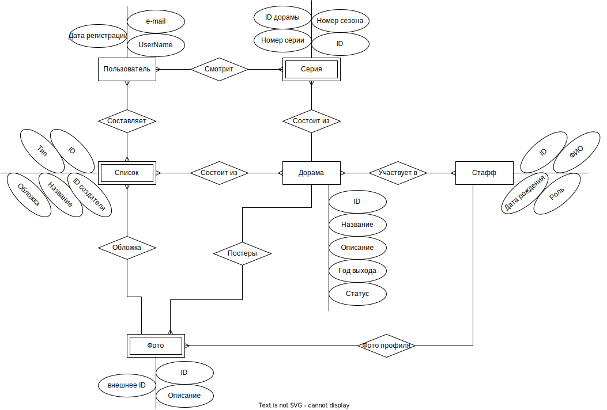

# ДорамаСет

## Идея проекта
Приложение для составления списков азиатских фильмов и сериалов на просмотр с кастомизируемыми тематиками. Имеется возможность отмечать прогресс просмотра. 

[//]: <(и следить за фильмографией актеров. )>

## Предметная область

* Создание тематических списков фильмов и сериалов.
* Отслеживание прогресса просмотра.

[//]: <(Подписка на фильмографию актеров)>

## Анализ аналогичных решений 

| Название | Составление   тематических списков | Отслеживание   прогресса просмотра | Просмотр   списков пользователей |
|:---:|:---:|:---:|:---:|
| Кинопоиск | - | + | + |
| DoramaLive | - | + | - |
| IMDb | + | - |  - |
| MyShows | + | + | - |
| Мое решение | + | + | + |

[//]: <(В кинопоиске отсутствует возможность отслеживать прогресс просмотра сериалов, у которых нет возможности просмотра на сервере. На MyShows создание списков возможно только с платной подпиской)>

## Целесообразность и актуальность проекта

Среди различных проектов для просмотра азиатского кино нет удобного приложения для отслеживания прогресса просмотра и составления различных тематических списков, которыми можно поделиться с другими пользователями. Данный проект можно будет развивать, постепенно добавляя новые функции, улучшающие удобство пользователя.

## Use-Case - диаграмма

## ER-диаграмма сущностей 

[//]: <(не путать с диаграммой БД – диаграмма сущность-связь не приземлена на конкретную СУБД и показывает сущности системы);>

## Пользовательские сценарии 

*Создать список*: на домашней странице пользователь нажимает кнопку "Мои списки", следом нажимает на кнопку с плюсом, появляется форма для создания списка. Пользователь вводит все необходимые данные (название, тип (публичный или приватный), описание) и нажимает на кнопку "сохранить". После этого данные, введенные пользователем, попадают в БД, а в меню просмотра списков появится новый, пустой список.

*Просматривать свои списки*: на домашней странице есть кнопки "Мои списки" и "Избранное". Нажав на одну из них, пользователь увидит или списки, созданные им, или сохраненные списки других пользователей. Нажав на любой из списков, можно просмотреть содержимое.

*Просматривать чужие публичные списки*: публичные списки доступны с главной страницы. Нажав на любой из них, пользователь увидит содержимое списка.

*Сохранить чужой список в избранное*: открыв любой чужой публичный список, пользователь может нажать на кнопку с сердечком (лайк). После этого данный список появляется у пользователя в окне "избранное".

*Добавить дораму в список*: открыв страницу любой дорамы, пользователь может нажать на кнопку "добавить в список". Появится окно со всеми списками пользователя. Пользователь может нажать на список, в который добавится данная дорама.

*Отметить прогресс в просмотре*: пользователь открывает страницу дорамы. Если это фильм, то он нажимает на кнопку "просмотрено". Если это сериал, то он может выбрать эпизод и нажать на кнопку "просмотрено".

*Оформить подписку*: пользователь нажимает на кнопку рядом со своим никнеймом и выбирает подпункт "оформить подписку". Далее он оплачивает ее, у него меняется статус на ту подписку, которую он выбрал.

*Отказаться от подписки*: пользователь нажимает на кнопку рядом со своим никнеймом и выбирает подпункт "отменить подписку". После этого, по истечению оставшегося срока, статус пользователя меняется на базовую подписку.

*Поиск информации*: пользователь в строку поиска вводит интересующую его информацию. Появляется страница с результатами поиска. 

*Получение баллов*: Пользователь может получить баллы следующим образом:
1. За ежедневный вход +5 баллов.
2. За каждые 50 просмотров +10 баллов.
3. За вход после долго отсутствия (более чем полгода) +50 баллов за вход единовременно.   
Баллы можно потратить на подписку.   

## Формализация бизнес-правил 

## Технологический стек

* *Тип приложения* - Web SPA  
* *backend* - go  
* *frontend* - ReactJS  
* database - PostgreSQL  

## Верхнеуровневое разбиение

## UML

## ER-диаграмма БД

